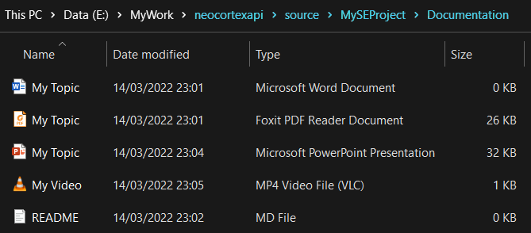
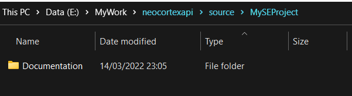
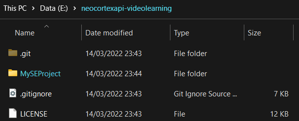
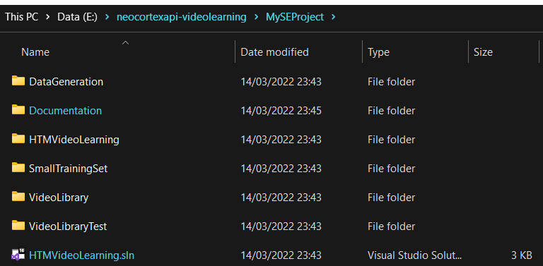
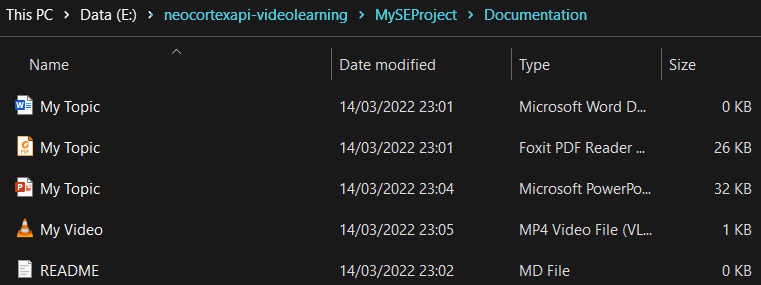
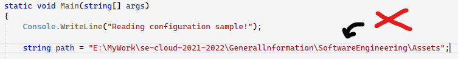
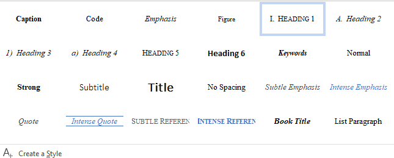

**Project start** January 10th 2023

**Project end** March. 30th 2023

which is 11 weeks and 2 days, be sure to plan your work evenly.

Create a detailed project description in a Markdown file.
The description of the project should fit on a single page.
Describe what has to be done, what problem is solved, and how it will be done.
Provide your personal project plan.

## Deliverables:
### 1. Project Structure:**
- All your project-related work should be placed in the folder 'MySEProject' on your group branch, see [example](https://github.com/UniversityOfAppliedSciencesFrankfurt/se-cloud-2022-2023/tree/master/Source/MySEProjectSample).
- Under the folder* MySEProject* must be a  subfolder with the name **'Documentation'** , which includes the following files: ***md, docx, pdf, pptx and mp4**.
- For the project with Forked Repos and unable to put your work to a single folder. Please make sure your submission issue include the right link to your work in the forked repos and the Documentation files.
- There are 2 kinds of structure:
a. **For teams who work directly in [neocortexapi](https://github.com/ddobric/neocortexapi)**, 'MySEProject' should be inside 'source' and contain your 'Documentation. As you were working inside the NeocortexApi source on UnitTests, Experiments, ..., where you have modify the code should be well documented in the markdown file.

<figcaption><i>Fig.1 - Project Structure for groups who work directly on NeocortexApi/ NeocortexApi's forks</i></figcaption>

.
b. **For teams who work on project which referenced [neocortexapi nuget package](https://www.nuget.org/packages/NeoCortexApi/)**, 'MySEProject' should be under root folder and contain your 'Documentation' as well as your project's code.
If you work on a forked repos and the Project structure is different, please put the project code and the solution inside 'MySEProject' before the evaluation starts.

<figcaption><i>Fig.2 - Project Structure for teams who work on project which referenced neocortexapi nuget package</i></figcaption>

### 2. Project Code:
- Project code must be fully documented, which means **Code Formating** and **Code Comments**.
- **Code Formating** reference can be check on **[this StackOverflow thread](https://stackoverflow.com/questions/29973357/how-do-you-format-code-in-visual-studio-code-vscode)**.
- **Code Comments** means_all classes and methods MUST be documented_ (use Visual Studio "///" to generate comments on classes and methods in your code). This should be used for public methods, variables and public classes.
For example documentation of the following method[**GetHammingDistance**](https://github.com/ddobric/neocortexapi/blob/0348ffb99739ddf8c8c3a875f8162a18073938ca/source/NeoCortexApi/Utility/MathHelpers.cs#L11-L16):
~~~csharp
/// 

        /// Calculates the hamming distance between arrays.
        /// 

        /// <param name="originArray">Original array to compare from.</param>
        /// <param name="comparingArray">Array to compare to.</param>
        /// <returns>Hamming distance.</returns>
        public static double GetHammingDistance(int[] originArray, int[] comparingArray, bool countNoneZerosOnly = false)
        {
            ... // Code snipplet taken from NeocortexApi
        }
~~~

- Please also comment on important lines of code, example [MultisequenceLearning.cs](https://github.com/ddobric/neocortexapi/blob/0348ffb99739ddf8c8c3a875f8162a18073938ca/source/Samples/NeoCortexApiSample/MultisequenceLearning.cs#L99-L113)
~~~csharp
HomeostaticPlasticityController hpc = new HomeostaticPlasticityController(mem, numUniqueInputs * 150, (isStable, numPatterns, actColAvg, seenInputs) =>
            {
                if (isStable)
                    // Event should be fired when entering the stable state.
                    Debug.WriteLine($"STABLE: Patterns: {numPatterns}, Inputs: {seenInputs}, iteration: {seenInputs / numPatterns}");
                else
                    // Ideal SP should never enter unstable state after stable state.
                    Debug.WriteLine($"INSTABLE: Patterns: {numPatterns}, Inputs: {seenInputs}, iteration: {seenInputs / numPatterns}");
                ...
            }, numOfCyclesToWaitOnChange: 50);
~~~
- In case the code is lengthy, you can also use #region to wrap code blocks for better review and reference. Example [**VideoLearning.cs**](https://github.com/ddobric/neocortexapi-videolearning/blob/c22936064d882cb48565e3f32ae8ba83ceb4031d/HTMVideoLearning/VideoLearning.cs#L18-L435)
~~~csharp
#region Run1: Learning with HtmClassifier key as FrameKey
        /// 

        ...
#endregion
~~~
- Projet code must be compilable. Please try to reduce the number of warnings as much as possible.
- Your project must run independently on other machine, avoid using fixed local file path. If it is inevitable, describe the setup procedure in the md.
- Test files used by UnitTests must be committed to GIT and not left on your local machine.
- To be sure that all are committed correctly, clone your branch to a different location (some other folder than the folder used during development) and run it.
- If you deal with some local files, use relative paths instead of absolute paths.

<figcaption><i>Fig.3 - Avoid using absolute path in your project</i></figcaption>

### 3. Markdown file md:
- The md should include the architecture of the solution (include at least one picture) and instruction to ensure the reader to reproduce what you did in the project.
- Please keep the personal information away from this document, Names, Group name, ... it should only contain the name of the project may be dates.
- Each project should have at least an README.md, there are no limits in a number of md files, but all of them should serves the purpose of better describe your project. [**Example markdown from NeocortexApi**](https://github.com/ddobric/neocortexapi#readme)
### 4. Document docx:
- The pdf submission is exported from this doc.
- Document the project by using of IEEE template provided [here](https://github.com/UniversityOfAppliedSciencesFrankfurt/se-cloud-2022-2023/blob/master/Generallnformation/Report%20Template%20A4%20Masters%20course%20IT.docx).
The structure should be followed by [IMRAD](https://en.wikipedia.org/wiki/IMRAD) standard.
- You must submit a printed copy of your documentation DOCX or PDF and PPTX to the university examination office. At the moment we had online course, so a pdf submission is also available on moodle.
#### NOTICE:
- All figures, tables or code blocks must have a caption and must be referenced from somewhere in the text.
- Abstract must not have references
- Intro and Methods have references to non-student work.
- Results should have back-references to methods and intro. No references to non-student work. If that happens, the structure of the work is bad.
- Do not use code as image (copy/paste). Reference the code in the repository and put a reference in the list of references. If some code snippet is very important, paste it in shortened form if required.
- All images, tables, code-blocks MUST be referenced from the text. If no reference, student should remove it from the document.
- Do not use normal text for headings. There are styles for Headings and caption.

<figcaption><i>Fig.4 - Using styles for your headings</i></figcaption>

- No Forward Referencing.
### 5. Presentation pptx and mp4:
- Short PowerPoint presentation as PPTX, you can use recorder in Power Point.
- There is no rule for how long should be your presentation.
- The presentation should only be a short recap of documentation up to 10 slides.
### NOTICE:
- We are working on a **Youtube Channel**
for hosing your work as video for later batch.
- **TODO** add requirement for YouTube video | adding link/process to upload video.

## Creating an issue on your final project review

Issue Name: Your Project Name GroupName
Example: ML20/21-5.11-Implement a correlation diagram TeamTest
Add the Project Review Request tag.
Assign the people in the group and the people included.

Hello Professor,
sample text... your text...
we would like you to review our software engineering project. Brief summary on your project.
You will create this issue when you have the first parts of the project done and need to start a discussion.
Project Name

ML XY..
Group Name
BestStudentGroup

Link to project:

Please also include explaination in case the project link is complicated
Forked Repo: link
Document: link
Markdown file: link
...

https://github.com/UniversityOfAppliedSciencesFrankfurt/se-cloud-2022-2023/groupbranch/MyCloudProjectSample
Contribution links:

Student1 ..
Student 2..
